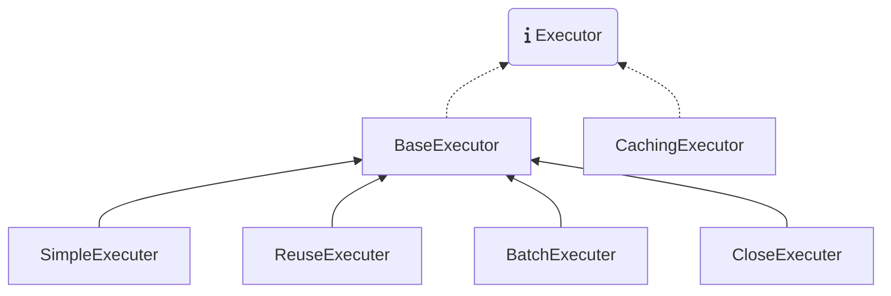
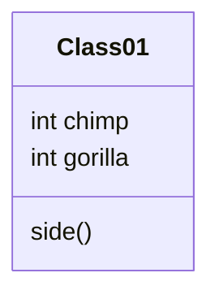

# 测试

```mermaid
graph BT
	BaseExecutor-.-> Executor(fa:fa-info Executor)
	CachingExecutor-.->Executor
	SimpleExecuter-->BaseExecutor
	ReuseExecuter-->BaseExecutor
	BatchExecuter-->BaseExecutor
	CloseExecuter-->BaseExecutor
```

测试第二部

```mermaid
classDiagram
Class01 : int chimp
Class01 : int gorilla
Class01 : side()
```

git graph

```mermaid
gitGraph:
options
{
    "nodeSpacing": 150,
    "nodeRadius": 10
}
end
commit
branch newbranch
checkout newbranch
commit
commit
checkout master
commit
commit
merge newbranch
```
