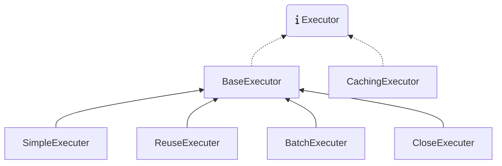

# 测试

```mermaid
graph BT
	BaseExecutor-.-> Executor(fa:fa-info Executor)
	CachingExecutor-.->Executor
	SimpleExecuter-->BaseExecutor
	ReuseExecuter-->BaseExecutor
	BatchExecuter-->BaseExecutor
	CloseExecuter-->BaseExecutor
```

